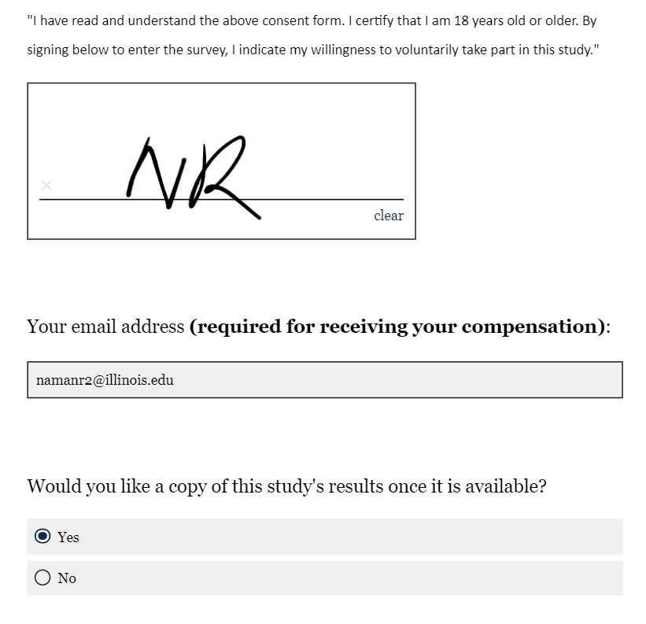

# An Experimental Testbed for Evaluating Co-Creativity in Human-Human and Human-AI Teams

*Developed by Yijun Lin, Babak Hemmatian & Naman Raina.*

---

## Table of Contents

- [Introduction](#introduction)
- [Motivation](#motivation)
- [How-to Instructions](#how-to-instructions)
  - [Two-Computer Interaction](#two-computer-interaction)
  - [Single-Computer Interaction](#single-computer-interaction)
- [FAQs](#faqs)

---

## Introduction
We present a new experiment platform to address this gap by allowing controlled study of human-AI and human-human teams in a creative task. We have created a cooperative version of the classic Alternate Uses Test (AUT; Guilford, 1967), where the goal is to produce as many original and practical creative uses for an everyday object as possible within a time limit. Our platform allows co-players to interact freely during the ideation stage before choosing their personal responses during the curation step. Our original webapp allows identical procedures to be used for human-human and human-AI pairs and experimental controls to be applied to the chat. The results can be evaluated using the same procedures as in the standard individual test of creativity. We currently use GPT-4 as the AI agent, but the platform’s modularity allows us to replace it with more or less advanced algorithms as needed.

## Motivation
An emerging consensus in the cognitive sciences states that flexible, adaptive behavior (i.e., intelligence) does not come from individuals alone, but rather often reflects the competent incorporation of knowledge and skills from one’s community (Sloman & Fernbach, 2018). For instance, research identifies the ability to successfully coordinate with one’s team members, called their collective intelligence (CI), as a much better predictor of group outcomes than individual IQs (Riedl et al., 2022). Although creativity is an increasingly important manifestation of intelligence in the information economy, creativity research has not kept up with this collective shift in the cognitive sciences.

## How-to Instructions

### Two-Computer Interaction

1. Open a browser - Google Chrome, Microsoft Edge, or Mozilla Firefox.
2. Take the Qualtrics survey in a separate tab. Please make sure that paired participants take the same survey to avoid timing mismatches.
   - **Links:** [Pre-Test](https://illinois.qualtrics.com/jfe/form/SV_eFeqLBEoz6mqcaq) and [Post-Test](https://illinois.qualtrics.com/jfe/form/SV_cNfEeh6SoG0OnnU)
   <figure>
     
     <figcaption><b>Figure 1:</b> Filled out First Page of Qualtrics Survey</figcaption>
   </figure>
3. At the bottom right of the page, click the right arrow to proceed to the next page of the form. Please take at least <u>1 minute</u> to read the instructions as the right arrow will not appear until one minute has passed.
   <figure>
     
     <figcaption><b>Figure 2:</b> Instructions Page of Qualtrics Survey</figcaption>
   </figure>
4. More instructions here...

## FAQs
(TODO: Add content here)
