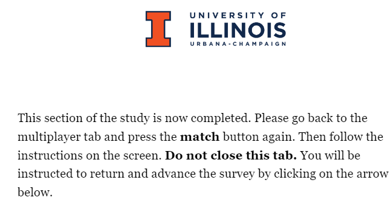

# An Experimental Testbed for Evaluating Co-Creativity in Human-Human and Human-AI Teams

*Developed by Yijun Lin, Babak Hemmatian, Haotian Wang, and Naman Raina.*

---

## Table of Contents

- [Introduction](#introduction)
- [Motivation](#motivation)
- [How-to Instructions](#how-to-instructions)
  - [Two-Computer Interaction](#two-computer-interaction)
  - [Single-Computer Interaction](#single-computer-interaction)
- [FAQs](#faqs)

---

## Introduction

We present a new experiment platform to address this gap by allowing controlled study of human-AI and human-human teams in a creative task. We have created a cooperative version of the classic Alternate Uses Test (AUT; Guilford, 1967), where the goal is to produce as many original and practical creative uses for an everyday object as possible within a time limit. Our platform allows co-players to interact freely during the ideation stage before choosing their personal responses during the curation step. Our original webapp allows identical procedures to be used for human-human and human-AI pairs and experimental controls to be applied to the chat. The results can be evaluated using the same procedures as in the standard individual test of creativity. We currently use GPT-4 as the AI agent, but the platform’s modularity allows us to replace it with more or less advanced algorithms as needed.

## Motivation

An emerging consensus in the cognitive sciences states that flexible, adaptive behavior (i.e., intelligence) does not come from individuals alone, but rather often reflects the competent incorporation of knowledge and skills from one’s community (Sloman & Fernbach, 2018). For instance, research identifies the ability to successfully coordinate with one’s team members, called their collective intelligence (CI), as a much better predictor of group outcomes than individual IQs (Riedl et al., 2022). Although creativity is an increasingly important manifestation of intelligence in the information economy, creativity research has not kept up with this collective shift in the cognitive sciences.

## How-to Instructions

### Two-Computer Interaction

1. Open a browser - Google Chrome, Microsoft Edge, or Mozilla Firefox.
2. Take the Qualtrics survey in a separate tab. Please make sure that paired participants take the same survey to avoid timing mismatches.
   - **Links:** [Pre-Test](https://illinois.qualtrics.com/jfe/form/SV_eFeqLBEoz6mqcaq) and [Post-Test](https://illinois.qualtrics.com/jfe/form/SV_cNfEeh6SoG0OnnU)
3. Once you reach the second page of the survey, please take at least **1 minute** to read the instructions as the right arrow will not appear until one minute has passed.

  

4. For the Pre-Test the next page will require you to spend two minutes writing up the creative uses of the assigned item (in this case it is a safety pin).
   For the Post-Test the next page you will see is the instructions page that you should read before you head over to the [chat app.](https://aicreativity-frontend.onrender.com)

    

    
    
  

  

    <em>Pre Test</em> &nbsp;&nbsp;&nbsp;&nbsp; <em>Post Test</em>
  

5. For the Pre-Test you will see the following page. Please read the instructions **carefully** and use this link for the [chat app.](https://aicreativity-frontend.onrender.com)
For the Post-Test, after you are done with Round 1, please spend 5 minutes writing in detail to answer the prompt below.

   

    
    
  

  

    <em>Pre Test</em> &nbsp;&nbsp;&nbsp;&nbsp; <em>Post Test</em>
  

6. For the Pre-Test, once you are done with Round 1, please spend 5 minutes writing in detail to answer the prompt below. For the Post-Test, please follow the instructions below and begin matching again for the next round. 
    

    
    
  

  

    <em>Pre Test</em> &nbsp;&nbsp;&nbsp;&nbsp; <em>Post Test</em>
  

7. For the Pre-Test, please follow the instructions below and begin matching again for the next round. The above steps need to be repeated for both Pre/Post-Test until the end of the third round.

   

     
      
     <em>Pre Test</em>
   

8. The rest of the survey has very clear instructions and is easy to follow - if there are any questions please see the FAQs section.

### Single-Computer Interaction
1. Create two new tabs.
2. In both, head over to the [chat app](https://aicreativity-frontend.onrender.com/).
3. Please login or register with **two different** profiles when the login page appears. Also, make sure the usernames and avatars chosen are easy to identify.
4. Once the chat app page shows up, select 'match' in the top-left corner in both tabs.
5. Either use
## FAQs
### Where can I find the constant responses?
The link is [here.](https://github.com/foogeeks/AI-creativity/blob/3condition/server/config/constResponse.js)
### How do I match and chat?
1. Head over to the [chat app](https://aicreativity-frontend.onrender.com/).
2. You will be prompted to the following page:

   

     
      
     <em>Login Page for Chat App</em>
   

3. Enter your information (note that registration requires a password confirmation).
4. Choose an avatar and type in your name as shown below:

   

     
      
     <em>Enter Name & Choose Avatar</em>
   

5. You will see this screen (do refresh so that you can see the avatar on the top right). Click on "match".

   

     
      
     <em>Match Page</em>
   

   
7. You will be directed to the chat screen. Type "ready" to get started.

    

     
      
     <em>Chat Page</em>
   

   
### The chat app is unresponsive. What do I do?
Please refresh the page and the chat app will restart from the round (Human, Interactive AI, or Constant) you were currently in. If the problem persists, please log out and then log in again. 

### I want to provide feedback on the chat app. Who should I contact?
Please contact babak2@illinois.edu.
