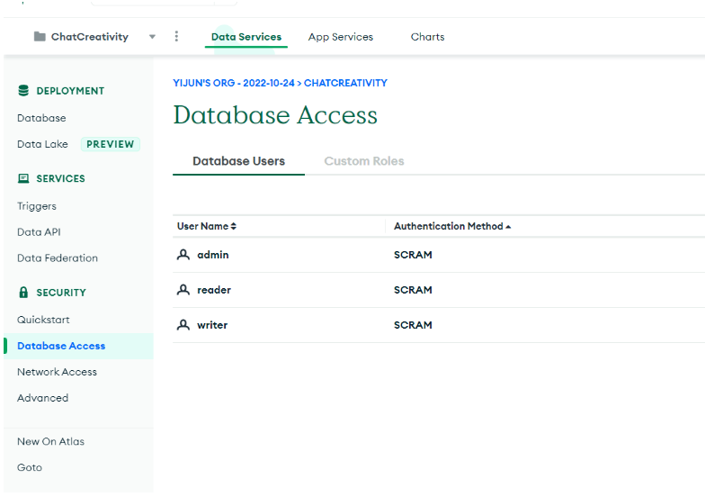

# Mongo Database

## Manage MongoDB

We don’t need most of the usages. For adding or removing database accounts, we go to “**Database Access**”. In further development, for security reason, we might want to use “**Network Access**” to block other IPs from accessing the database.

## Usernames and Passwords
please see https://docs.google.com/document/d/1CJ-Pv3Pd7v6jIxjWyVSE1BukllCYnb0lrCCl2TqXVjg/edit?usp=share_link

## Connection
One easy way to connect and manage MongoDB is using MongoDB Compass. 

In “new connection”, type the connection URL here. (fill the username and password in above table)

URL:
`mongodb+srv:// [username]:[password]@chatcreativity.0edw3nj.mongodb.net/test`

## Add Data

In the image above, we select **"ADD DATA"-"Import File"-"Choose a file"**. Then we just select a .csv file. The file needs to follow a certain format. The first row will be the column name. Take the instruction database as an example, “_id” and “text” will be two columns, but “_id” will be generated by MongoDB, so in the csv file we just need text. Like below:

Note that we don’t need to add further instruction text like “now it is your turn” to the database. These sentences are duplicated and will be added by the server. Also the file needs to be .csv format rather than .xlsx(it is easy to transfer format). Also, after adding or removing data from this collection, the env variable `ITEM_LEN`
needs to be changed.

## Export Data to File
Click the button and follow the steps. 

The output file format has the same format we use to import data.

## Schema

# Firebase
Most of the function of the firebase is not used. We only use firebase for account authentication. Go to “Build”-”Authentication” and we will see the user emails and user UID. The UID here corresponds to the user UID in MongoDB.

# Render API
## update environment variables
the file “update_env.py” contains four functions:

`print_services`: will print service name and its serviceId

`get_env`: will get all the environment variables for current service, return a map (key is env name, value is env value)

`update_env`: the function will call get_env to get the old env variables, the edit env variable part can be done inside the code as below:

It is basically editing the value of a key for a dictionary.

`manual_deploy`: this will deploy the service with the latest commit, the function should be called after updating environment variables.

For more API functions, please refer to https://api-docs.render.com/reference/introduction
Adding more functions is simple, just go to the right function, there is python code on the right. See below screenshot, the Update environment variables function. Basically we just need to fill in serviceId and Body params

## Environment Variables
### Note for Update Env
All the environment variables will be treated as string in Python for update. Even some of them are actually number, such as `WAIT_TIME=2`. You should set it to "2" in Python (`WAIT_TIME='2'`).
### Frontend
* `REACT_APP_FIREBASE_API_KEY` (string): for firebase, dont change
* `REACT_APP_FIREBASE_AUTH_DOMAIN` (string): for firebase, dont change
* `REACT_APP_FIREBASE_PROJECT_ID` (string): for firebase, dont change
* `REACT_APP_FIREBASE_STORAGE_BUCKET` (string): for firebase, dont change
* `REACT_APP_FIREBASE_MESSAGING_SENDER_ID` (string): for firebase, dont change
* `REACT_APP_FIREBASE_APP_I` (string): for firebase, dont change
* `REACT_APP_URL` (string): url for backend api
* `REACT_APP_SESSION_TIME` (integer): how long a chat lasts, in seconds (default 240)
* `REACT_APP_INSTRUCTION_1` (string): Instructions for the user, appears in order 1/3
* `REACT_APP_INSTRUCTION_2` (string): Instructions for the user, appears in order 2/3
* `REACT_APP_INSTRUCTION_3` (string): Instructions for the user, appears in order 3/3
* `REACT_APP_AVATAR_OPTION` (string): 
**human** (human avatar) | 
**bot** (rebot avatar) | 
**default** (user's avatar)

### Backend
* `PORT` $ (integer): port the service is listening to (default 8080)
* `MONGO_URI` (string): url for connection to mongoDB
* `MATCH_AI` (string): whether to match user with AI. values: 'true', 'false'
* `OPENAI_API_KEY` (string): key for openAI API key
* `AI_UID` (string): UID that is actually the AI
* `AI_VERSION` (string): version of AI: 
**GPT-3** (using davinci-002, not optimized for conversation) | 
**ChatGPT** (using davinci-003, more optimized for conversation) | 
**Constant** (no model, a constant list of responses)
* `WAIT_TIME` (integer): seconds of waitting after the last response before the AI sends another (default 5)
* `WAIT_TIME_DIFF` (integer): the actual waiting time for a particular response will be randomly chosen from the range [WAIT_TIME-WAIT_TIME_DIFF, WAIT_TIME+WAIT_TIME_DIFF]
* `ITEM_LEN` (integer): the total number of items for which creative ideas can be generated (this should be changed when new items are pushed to the database)
* `TRY_TIME` (integer): the number of retries when OPENAI gets repeated.
* `ITEM` (string): The target item to be used for the next session, e.g. 'paperclip'
* `AI_INS` (string): the prompt used for requesting completions from ChatGPT
* `END_PROMPT` (string): the prompt for ChatGPT when user has generated no response yet.
* `CONS_LIST` (string): The list of replies for the constant version of AI. Formatted as follows: 'reply1,reply2,reply3,reply4,reply5,reply6,reply7,reply8'
* `COMMON_WORD` (string): Words that are not counted as repeated if they show up in previous responses. These are used to identify cases where the AI generates responses that are identical to or very close to previous ones, so that they are prevented from getting added to prompts for the next response or being posted to the chat.
